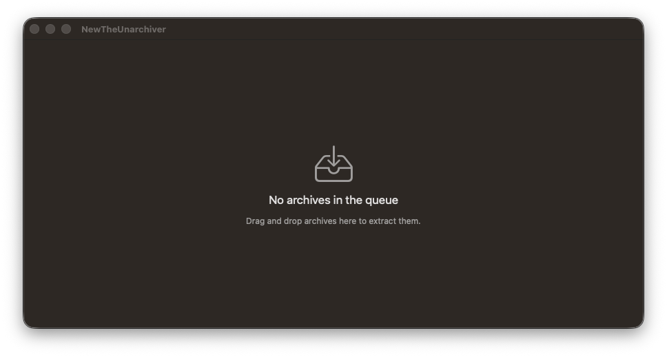
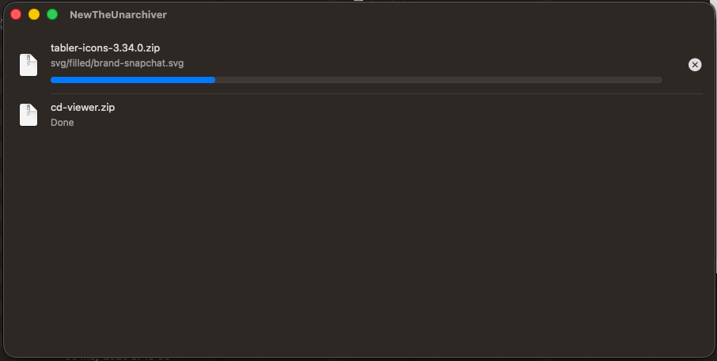
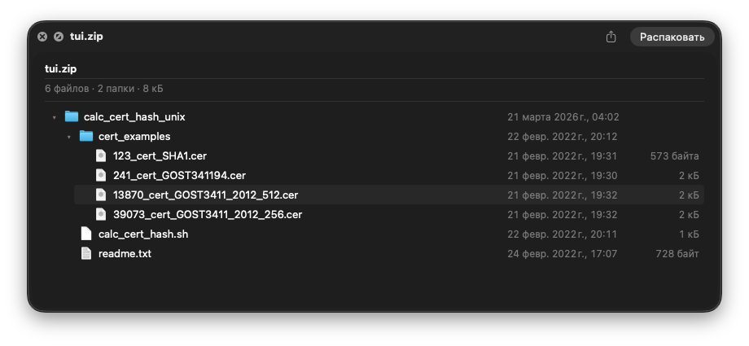
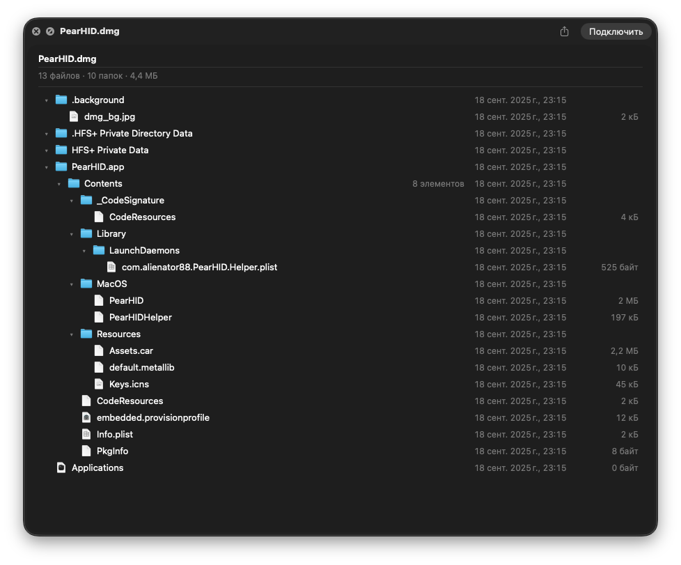
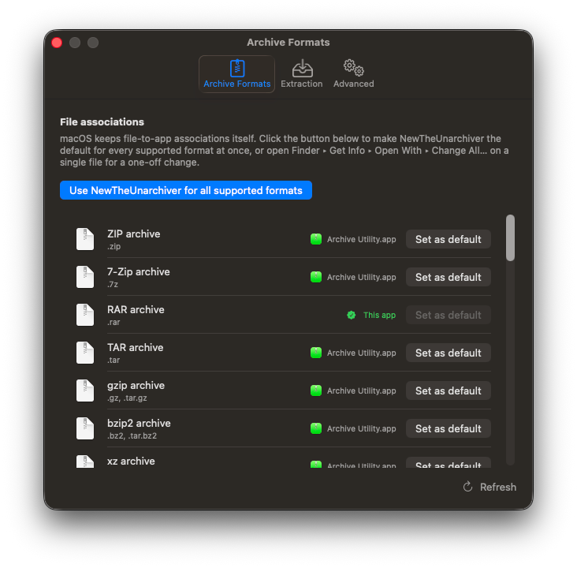
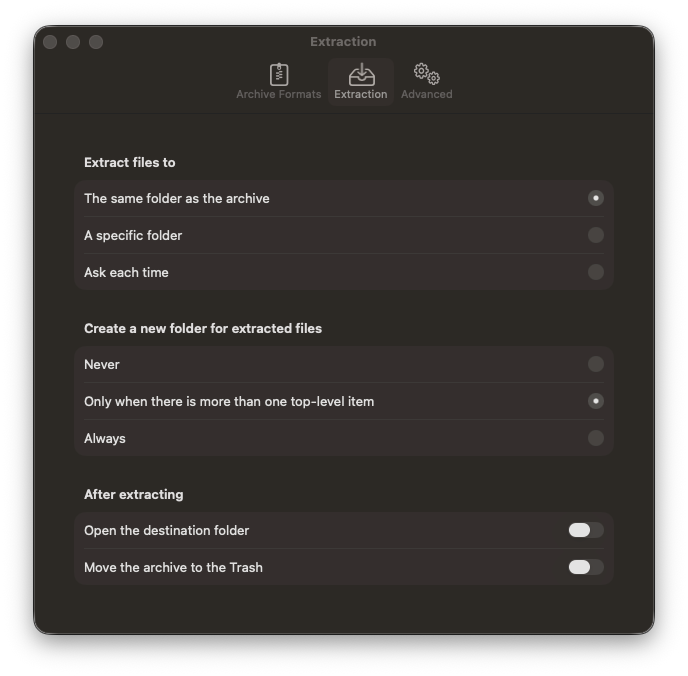
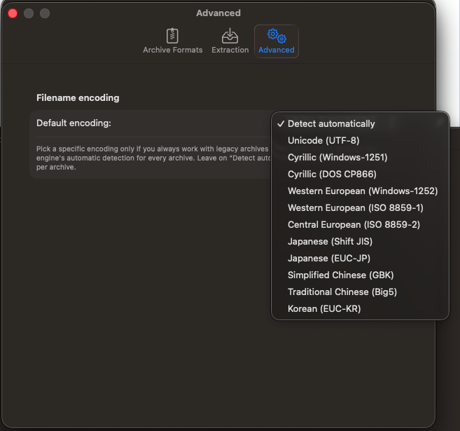

**English** · [Русский](README_RU.md)

# New The Unarchiver for macOS

A small, quiet extractor for Mac. Drop an archive on it, get your files.
More than 50 file types, under 15 MB, no background agents and no nagging.



The original [The Unarchiver](https://theunarchiver.com) earned its place by
doing one thing and doing it well. This is a modern successor in the same
spirit: a native SwiftUI app on top of a new cross-platform Rust engine, with
no feature creep and nothing running when you are not extracting.

It **only extracts**. It never creates archives — there are good tools for
that, and Finder already compresses to ZIP.

> **Status: beta.** The app is complete and in daily use; builds are not
> notarized yet. See [Running an unsigned build](#running-an-unsigned-build).

## What it does better than its predecessor

### It extracts several archives at once

Queue up a folder full of archives and they extract in parallel — up to four at
a time, scaled to your CPU. On a batch of archives this cuts the wait several
times over rather than trickling through them one by one.



The queue is careful rather than greedy: work on an external drive or a spinning
disk falls back to one job at a time, because parallel reads make those slower,
not faster. Each row shows the file currently being written and a progress bar
for the whole archive, and can be cancelled on its own.

Four is a deliberate ceiling: speed here depends on I/O as much as on core count,
and past four workers the disk sets the pace, so more of them buys nothing today.
We will raise it when I/O gets faster.

### It shows you what is inside, before you extract

Press Space on any supported archive and Quick Look renders the real contents —
a browsable folder tree with sizes and dates, not a generic icon. Nothing is
written to disk to produce it.



This works for disk images too, including the ones macOS itself will not preview
without mounting:



### It supports formats the original never learned — and keeps the old ones

The engine reads more than 50 file types. Everything the classic Mac world ran
on is still there — StuffIt, BinHex, MacBinary, Compact Pro, PackIt — alongside
the DOS, CP/M and Amiga archivers that made the original beloved by people
opening decades-old files: ARJ, Zoo, LBR, ARC, ALZip, LZX, PowerPacker, DMS.

New since then: Brotli, Zstandard, LZ4, SquashFS, AppImage, Windows Imaging
(WIM/ESD/SWM), HFS+ images, Conda packages, Chrome extensions, and the modern
mainstream — ZIP (including AES and Deflate64), 7z, RAR, tar with every common
compressor, CAB, DEB, RPM, cpio, XAR, MSI, ISO, WARC, self-extracting `.exe`.

Encrypted archives prompt for a password, with an *Apply to All* option when a
whole batch shares one. Legacy filename encodings are detected automatically,
and can be overridden when detection cannot win.

### It stays out of your ecosystem

This is the part most extractors get wrong. New The Unarchiver:

- **does not replace your file icons** — it declares no document icons at all,
  so your archives keep looking the way macOS draws them;
- **does not seize file types on install** — it announces which formats it can
  open and stops there. Word keeps `.docx`, Books keeps `.epub`, DiskImageMounter
  keeps `.dmg`; the app merely appears in *Open With* for those;
- **has no background agent, no updater, no login item** — it runs when you open
  an archive and quits when you are done.

If you *want* it to take over, that is one button:



## Settings

Three tabs, no hidden preferences. Where files land, whether to wrap them in a
new folder, and what happens afterwards:



And, for archives from other decades and other alphabets, an explicit filename
encoding:



The interface is available in English and Russian.

## Install

1. Download the app from the [Releases page][releases].
2. Move it to your **Applications** folder.
3. Open it — see below for the first launch.

Requires macOS 26 or newer.

### Running an unsigned build

Beta builds are signed with a development certificate but **not notarized**,
so Gatekeeper refuses them on first launch with a message about the app not being
verified. This is expected. Two ways past it:

**Through System Settings** (no Terminal needed):

1. Double-click the app. macOS refuses — dismiss the dialog.
2. Open **System Settings ▸ Privacy & Security**.
3. Scroll to the **Security** section. A line names the blocked app, with an
   **Open Anyway** button next to it.
4. Click it, then confirm in the dialog that follows.

macOS remembers the decision; later launches are normal double-clicks.

**Through Terminal**, if you prefer one command — this removes the quarantine
flag macOS attaches to downloaded files:

```sh
xattr -dr com.apple.quarantine /Applications/NewTheUnarchiver.app
```

`-d` deletes the named attribute, `-r` applies it through the whole app bundle.
Run it before the first launch and there is no warning at all.

Only do this for software you actually trust — the quarantine flag exists for a
reason, and stripping it is exactly what it sounds like.

## Under the hood

All archive logic — format detection, decompression, passwords, encodings, path
safety — lives in [newtua-core][core], a cross-platform Rust engine, and reaches
the app through [newtua-swift][swift] as a prebuilt XCFramework. Swift handles
the interface and nothing else; no `rar`, `7z` or `tar` binaries are shelled out
to, and no Rust toolchain is needed to build the app.

Part of the [new-the-unarchiver][org] project.

[releases]: https://github.com/new-the-unarchiver/newtua-app-macos/releases
[core]: https://github.com/new-the-unarchiver/newtua-core
[swift]: https://github.com/new-the-unarchiver/newtua-swift
[org]: https://github.com/new-the-unarchiver
